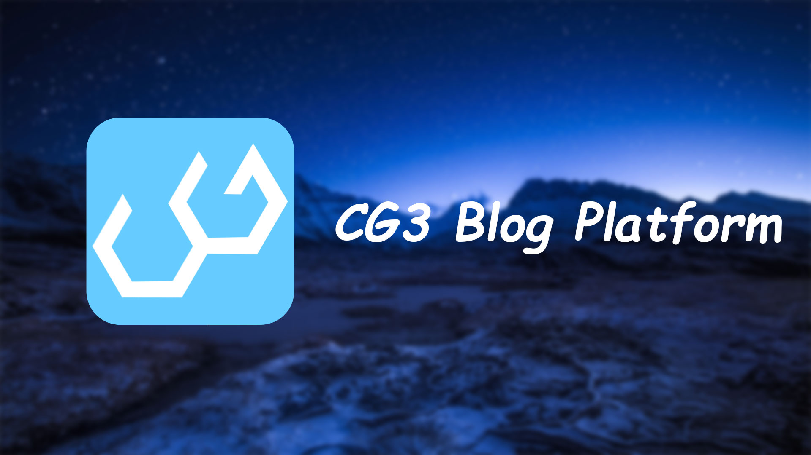

# CG3 Blog Platform
CG3 is a web-based application that can be best explained as a cross between a blogging platform and social media. It is a place for people to post and share content with their friends and connect with other people who have similar interests. Users are free to follow each other, share and interact with text or image-based content.

* **Login Page** - allows the user to login by entering username and password. 
* **Home Page** - shows the navigation, reserved area and a list of other’s blogs to users. 
* **Post Page** - allows users to write their posts and post to the website. 
* **User Profile Page** - shows the user their own profile, background information, and their own posts. This page also shows the user the accounts they are following and who they are followed by. It allows the user to edit their information. 

Developed with node.js(express) + Bootstrap + jQuery and deployed on heroku(PostgreSQL) and AWS Elastic Beanstalk.

The presentation is available on [YouTube](https://www.youtube.com/watch?v=bz4RqFCf4IQ).

[***Check it on Heroku***](https://stark-tor-10041.herokuapp.com/)

[***Check it on AWS Elastic Beanstalk***](https://cg3.garywei.dev/)

## Contribution & Claim
This website is the final project of UMass Amherst Spring 2021 CS 326 Team 4, which means it follows [UMass’ Academic Honesty Policy and Procedures](https://www.umass.edu/honesty/). Even though it is licensed under MIT License, no copy or plagiarism of codes is allowed if you want to use it as part of your homework/projects.

Forked from [garywei944/cs326_final_project](https://github.com/garywei944/cs326_final_project). The origin repository was archived because the course ended.

### Developers
* [garywei944](https://github.com/garywei944)
* [GavinDuan](https://github.com/GavinDuan513)
* [genglinliu](https://github.com/genglinliu)
* [peihengliu](https://github.com/peihenglyu)

## Back-End API and Routing
### Static and rendered pages
| Path             | Method   | Mark              |
| :-------         | -------- | -------           |
| `/`              | GET      | Home page         |
| `/login`         | GET      | Login page        |
| `/signup`        | GET      | Sign up page      |
| `/post`          | GET      | New post page     |
| `/post/:post_id` | GET      | Blog content page |
| `/:username`     | GET      | User profile page |

### DataBase lookup
| Path               | Method   | Function                           |
| :-------           | -------- | -------                            |
| `/db`              | GET      | Get list of tables in the DataBase |
| `/db/user_account` | GET      | Get the `user_account` table       |
| `/db/post`         | GET      | Get the `post` table               |
| `/db/liked`        | GET      | Get the `liked` table              |
| `/db/follow`       | GET      | Get the `follow` table             |

### API
| Path                            | Method   | Function                                            |
| :-------                        | -------- | -------                                             |
| `/api/homepage`                 | GET      | Get the tiles of all posts                          |
| `/api/login`                    | POST     | Post the username and password                      |
| `/api/register`                 | POST     | Post the username and Password                      |
| `/api/post`                     | POST     | Post the username, tile and content of the new post |
| `/api/blogpage_backened_like`   | POST     | Post new like                                       |
| `/api/blogpage_backened_follow` | POST     | Post new follow                                     |
| `/api/blogpage_poster`          | GET      | Get the author of a post                            |
| `/api/:username/posts`          | GET      | Get all posts of a user                             |
| `/api/:username/follower`       | GET      | Get all followers of a user                         |
| `/api/:username/following`      | GET      | Get all users that are followed by the user         |
| `/api/:username/liked`          | GET      | Get all users that are liked by the user            |
| `/api/:username/edit`           | POST     | Post an edit of the user's username and bio         |
| `/api/:username/follow`         | POST     | Post new follow                                     |
